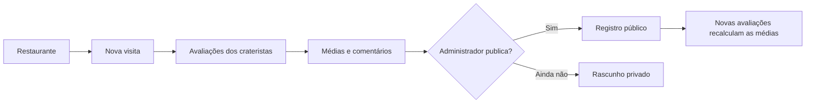
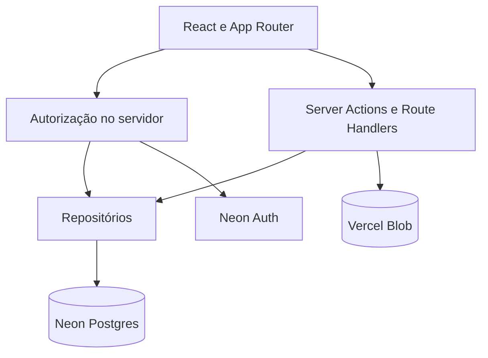

<div align="center">
  
  <h1>Crateristas</h1>
  <p><strong>Um livro coletivo de registros gastronômicos, construído ao redor de uma cratera muito importante.</strong></p>
  <p>
    <a href="https://crateristas.vercel.app"><strong>Visitar o site</strong></a>
    ·
    <a href="#como-funciona">Como funciona</a>
    ·
    <a href="#desenvolvimento-local">Executar localmente</a>
  </p>
</div>


## Sobre o projeto

O **Crateristas** nasceu de uma tradição entre amigos: visitar restaurantes, discutir cada detalhe da experiência e registrar uma avaliação construída pelo grupo. A cratera em frente ao restaurante favorito da sociedade tornou-se o símbolo e o ponto de partida dessa história.

O site combina uma experiência pública editorial com uma área privada para os integrantes. Visitantes exploram restaurantes, diferentes visitas, comentários, médias coletivas, menus, pratos e perfis. Crateristas autenticados registram experiências e o administrador decide quando cada registro está pronto para ser publicado.

## Funcionalidades

### Experiência pública

- entrada imersiva em Three.js com ciclo de dia e noite;
- landing page com restaurantes recentes, história e integrantes;
- livro de registros pesquisável;
- páginas de restaurante com paleta derivada das fotografias;
- navegação entre diferentes visitas ao mesmo restaurante;
- mesa de avaliação com média coletiva, categorias e comentários individuais;
- notas individuais acessíveis dentro do comentário de cada integrante;
- galeria de imagens em lightbox;
- história da sociedade e perfis públicos personalizáveis;
- layout adaptado para desktop e dispositivos móveis.

### Registros coletivos

- notas de `0` a `10` para comida, serviço, ambiente, custo-benefício, acesso/localização e tempo de espera;
- comentário curto e prato pedido por integrante;
- uma contribuição editável por integrante em cada visita;
- médias recalculadas sempre que uma contribuição é salva;
- publicação, ocultação e republicação controladas pelo administrador;
- criação de novas visitas para restaurantes já catalogados;
- importação assistida de informações a partir de links do Google Maps.

### Menus e pratos

- catálogo próprio para cada restaurante;
- busca por nome, descrição ou categoria preservada;
- páginas individuais de pratos com fotos e preço em destaque;
- avaliações de sabor, custo-benefício e UX;
- tempo de espera e RNG opcionais;
- RNG de `0%` a `100%`, em que valores maiores representam maior dependência da sorte;
- publicação independente dos registros de restaurante.

### Sociedade e administração

- cadastro por um convite compartilhado e reutilizável;
- autenticação por e-mail e senha com recuperação de acesso;
- perfil com foto, biografia e cargo oficial;
- numeração baseada apenas nos integrantes ativos;
- painel para acompanhar, criar e gerenciar avaliações;
- administração de convites, cargos, integrantes e publicações;
- remoção lógica de integrantes sem apagar suas contribuições históricas.

## Como funciona



Cada integrante avalia a mesma visita separadamente. O sistema reúne essas contribuições em uma avaliação coletiva, mas mantém os comentários, pratos pedidos e fichas individuais atribuídos aos seus autores. Salvar uma avaliação não publica o registro automaticamente: essa decisão continua com o administrador.

## Tecnologias

| Camada | Tecnologia |
| --- | --- |
| Interface | Next.js 16, React 19 e TypeScript |
| Estilo e movimento | CSS Modules, CSS e Three.js |
| Validação | Zod |
| Banco de dados | Neon Postgres |
| Autenticação | Neon Auth |
| Imagens | Vercel Blob |
| Testes | Vitest e Testing Library |
| Hospedagem | Vercel |

## Arquitetura

O projeto usa o App Router do Next.js. Leituras e páginas protegidas ficam no servidor; mutações passam por Server Actions ou Route Handlers que repetem a autorização junto à operação. A interface não acessa o banco diretamente.

```text
src/
├── app/                    # páginas, layouts, rotas de API e webhook
├── components/             # identidade, navegação, movimento e UI compartilhada
├── domain/reviews/         # regras, schemas, agregação e contratos de avaliações
├── features/               # auth, história, home, membros, menu, registros e visitas
└── lib/                    # autenticação, banco e repositórios do servidor

db/migrations/              # evolução versionada do schema PostgreSQL
docs/setup/                 # guias operacionais de Auth, cadastro, perfis e menus
docs/verification/          # checklists e evidências de verificação
public/                     # imagens, símbolos e modelos 3D
scripts/                    # migrations e verificações de deployment
```

Fluxo simplificado da aplicação:



## Desenvolvimento local

### Pré-requisitos

- Node.js 22 recomendado;
- projeto e branch no Neon Postgres;
- Neon Auth habilitado na mesma branch;
- store público no Vercel Blob.

Clone o projeto e instale as dependências:

```powershell
git clone https://github.com/Lucas-Cofcewicz-Faria/crateristas.git
cd crateristas
npm install
```

Crie um arquivo `.env.local` na raiz. Nunca coloque credenciais reais no README, em `.env.example` ou em commits:

```dotenv
DATABASE_URL=
TEST_DATABASE_URL=
NEON_AUTH_BASE_URL=
NEON_AUTH_COOKIE_SECRET=
NEON_AUTH_ALLOWED_EMAILS=
BLOB_READ_WRITE_TOKEN=
NEXT_PUBLIC_APP_URL=http://localhost:3000
```

| Variável | Uso |
| --- | --- |
| `DATABASE_URL` | conexão principal usada pela aplicação e pelas migrations |
| `TEST_DATABASE_URL` | banco descartável para testes PostgreSQL opcionais |
| `NEON_AUTH_BASE_URL` | URL do Neon Auth da branch atual |
| `NEON_AUTH_COOKIE_SECRET` | assinatura de sessão e dos convites; mínimo de 32 caracteres |
| `NEON_AUTH_ALLOWED_EMAILS` | acessos previamente autorizados, incluindo o administrador inicial |
| `BLOB_READ_WRITE_TOKEN` | upload e remoção server-side de imagens |
| `NEXT_PUBLIC_APP_URL` | origem pública usada em redirecionamentos de autenticação |

Aplique as migrations somente depois de confirmar que a URL aponta para o banco correto:

```powershell
npm run db:migrate
npm run dev
```

A aplicação ficará disponível em `http://localhost:3000`.

> [!CAUTION]
> `npm run build` executa as migrations durante o `prebuild`. Para conferir apenas a compilação sem escrever no banco configurado, use `node node_modules/next/dist/bin/next build`.

## Comandos úteis

| Comando | Descrição |
| --- | --- |
| `npm run dev` | inicia o servidor de desenvolvimento |
| `npm test` | executa a suíte de testes |
| `npm run test:watch` | acompanha os testes durante o desenvolvimento |
| `npm run lint` | executa o ESLint |
| `npx tsc --noEmit` | verifica os tipos sem gerar arquivos |
| `npm run db:migrate` | aplica as migrations usando `.env.local` |
| `npm run build` | aplica migrations e gera o build de produção |
| `npm start` | serve um build já gerado |

## Banco de dados

As migrations em `db/migrations` são aplicadas em ordem e registradas na tabela `schema_migrations`:

1. domínio inicial de restaurantes, visitas, integrantes, avaliações e fotos;
2. remoção segura dos registros do protótipo antigo;
3. exclusão administrativa de visitas;
4. prato pedido nas avaliações;
5. convite compartilhado e quantidade dinâmica de integrantes;
6. remoção lógica e auditável de integrantes;
7. múltiplas visitas, menus, pratos, avaliações e fotos de pratos.

Guias operacionais mais detalhados:

- [Neon Auth e webhook](docs/setup/neon-auth.md)
- [Cadastro por convite compartilhado](docs/setup/shared-signup.md)
- [Perfis dos integrantes](docs/setup/member-profiles.md)
- [Visitas e menus](docs/setup/visits-and-menu.md)
- [Checklist de verificação](docs/verification/crater-logbook-checklist.md)

## Segurança e privacidade

- senhas são administradas pelo Neon Auth e não são armazenadas no banco da aplicação;
- e-mails e identificadores de autenticação não fazem parte das projeções públicas;
- rotas privadas revalidam a sessão e o papel do integrante no servidor;
- novos cadastros dependem de um convite ativo;
- novos integrantes entram com o papel `member`;
- fotos são validadas, reprocessadas em WebP e limitadas antes do armazenamento;
- a importação do Google Maps aceita apenas hosts e redirecionamentos validados;
- integrantes removidos perdem o acesso, mas suas avaliações históricas permanecem atribuídas.

## Deploy

O projeto publicado está disponível em **[crateristas.vercel.app](https://crateristas.vercel.app)**.

Para criar outro ambiente:

1. conecte o projeto à Vercel;
2. conecte Neon Postgres, Neon Auth e Vercel Blob ao mesmo ambiente;
3. configure as variáveis sem copiá-las para arquivos versionados;
4. configure o webhook `user.before_create` do Neon Auth para `/webhooks/neon-auth`;
5. faça o deploy e confirme a aplicação das migrations;
6. valide páginas públicas, login, convite, upload e operações administrativas.

O projeto foi desenhado para permanecer dentro das cotas gratuitas da Vercel, Neon e Blob, mas isso depende do uso e dos limites vigentes de cada serviço.

---

<div align="center">
  <p><em>Sob o olhar do Monarca Guizão.</em></p>
</div>
