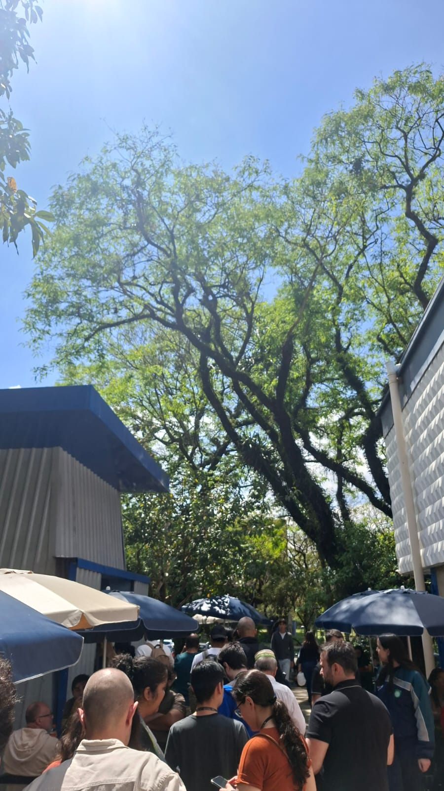
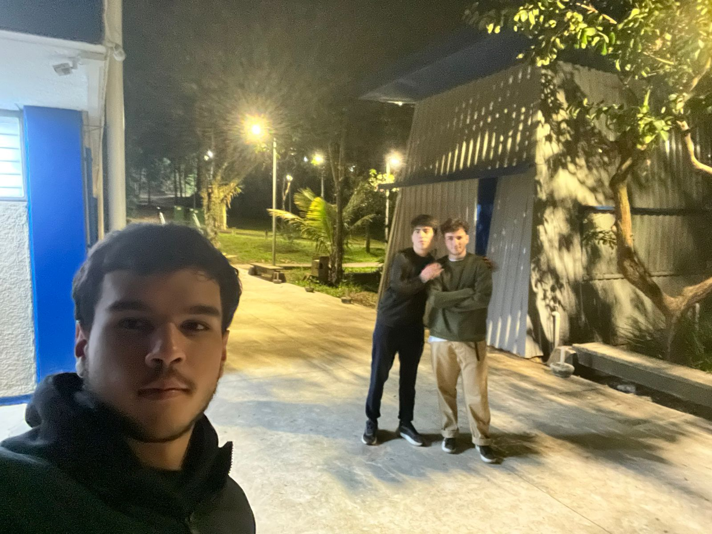
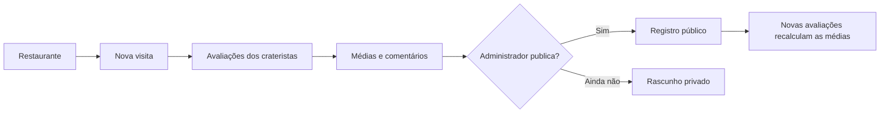
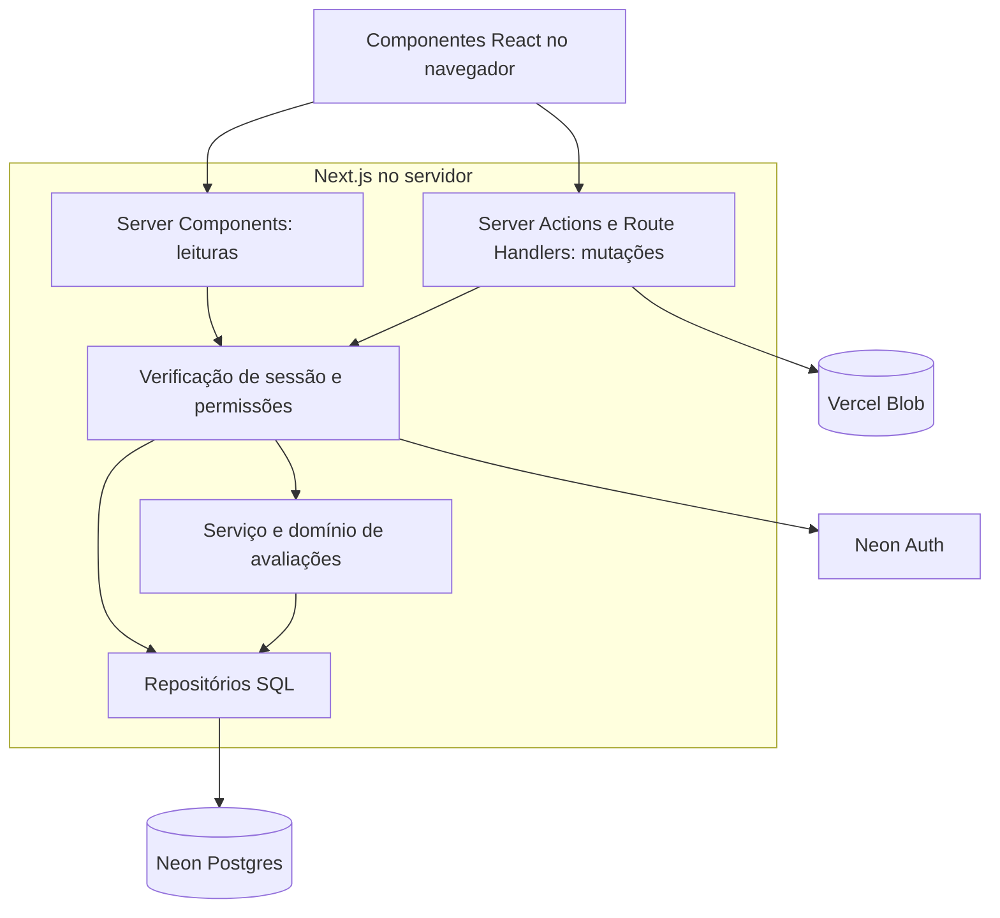
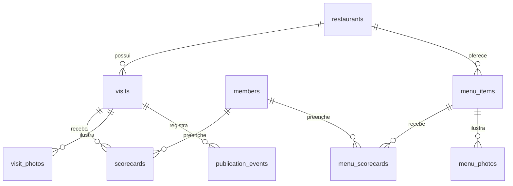

<div align="center">
  
  <h1>Uma mesa. Várias opiniões. Uma cratera.</h1>
  <p>Restaurantes, memórias e avaliações de um grupo de amigos, reunidos em uma aplicação web.</p>
  <p>
    <a href="https://crateristas.vercel.app"><strong>Visitar o site</strong></a>
    ·
    <a href="#como-funciona">Como funciona</a>
    ·
    <a href="#arquitetura">Arquitetura</a>
    ·
    <a href="#o-sistema-por-dentro">O sistema</a>
    ·
    <a href="#desenvolvimento-local">Executar localmente</a>
  </p>
</div>


## Sobre o projeto

O **Crateristas** transforma as saídas para comer entre amigos em um livro de registros gastronômicos. A ideia nasceu de uma piada interna: uma cratera em frente ao restaurante favorito do grupo ganhou importância suficiente para dar origem à sua própria sociedade.

Depois de cada visita, os integrantes registram suas notas, o prato pedido e um comentário. A aplicação calcula as médias e organiza essas contribuições ao redor de uma mesa. Quem visita o site pode conhecer os restaurantes, ler as opiniões e formar seu próprio veredito.

O projeto reúne frontend e backend em Next.js, com banco PostgreSQL, autenticação, armazenamento de imagens e uma entrada 3D. Toda a experiência está em português brasileiro, com layouts para desktop e mobile.

**Explore:** [Página inicial](https://crateristas.vercel.app/home) · [Registros](https://crateristas.vercel.app/registros) · [História](https://crateristas.vercel.app/historia)

## A história por trás da interface

Lucas liderou a primeira peregrinação depois de encontrar o restaurante no Google Maps. A caminhada sob o sol colocou a fé dos primeiros integrantes à prova; a refeição no destino consolidou a tradição. Entre encontros, pratos sagrados e o olhar do Monarca Guizão, a sociedade ganhou um arquivo próprio.

As fotografias abaixo fazem parte dos capítulos de história da aplicação.

<table>
  <tr>
    <td width="50%" align="center">
      <br />
      <sub>A descoberta: o começo das peregrinações.</sub>
    </td>
    <td width="50%" align="center">
      <br />
      <sub>A peregrinação: um caminho que virou tradição.</sub>
    </td>
  </tr>
</table>

## Funcionalidades

### Experiência pública

- entrada imersiva em Three.js com ciclo de dia e noite;
- landing page com restaurantes recentes, história e integrantes;
- livro de registros pesquisável;
- páginas de restaurante com paleta derivada das fotografias;
- navegação entre diferentes visitas ao mesmo restaurante;
- mesa de avaliação com média coletiva, categorias e comentários individuais;
- notas individuais acessíveis dentro do comentário de cada integrante;
- galeria de imagens em lightbox;
- história da sociedade e perfis públicos personalizáveis;
- layout adaptado para desktop e dispositivos móveis.

### Registros coletivos

- notas de `0` a `10` para comida, serviço, ambiente, custo-benefício, acesso/localização e tempo de espera;
- comentário curto e prato pedido por integrante;
- uma contribuição editável por integrante em cada visita;
- médias recalculadas sempre que uma contribuição é salva;
- publicação, ocultação e republicação controladas pelo administrador;
- criação de novas visitas para restaurantes já catalogados;
- importação assistida de informações a partir de links do Google Maps.

### Menus e pratos

- catálogo próprio para cada restaurante;
- busca por nome, descrição ou categoria preservada;
- páginas individuais de pratos com fotos e preço em destaque;
- avaliações de sabor, custo-benefício e UX;
- tempo de espera e RNG opcionais;
- RNG de `0%` a `100%`, em que valores maiores representam maior dependência da sorte;
- publicação independente dos registros de restaurante.

### Sociedade e administração

- cadastro por um convite compartilhado e reutilizável;
- autenticação por e-mail e senha com recuperação de acesso;
- perfil com foto e biografia; o cargo oficial é atribuído pelo administrador;
- numeração baseada apenas nos integrantes ativos;
- painel para acompanhar, criar e gerenciar avaliações;
- administração de convites, cargos, integrantes e publicações;
- remoção lógica de integrantes sem apagar suas contribuições históricas.

## Como funciona



Cada integrante avalia a mesma visita separadamente. O sistema reúne essas contribuições em uma avaliação coletiva, mas mantém os comentários, pratos pedidos e fichas individuais atribuídos aos seus autores. Salvar uma avaliação não publica o registro automaticamente: essa decisão continua com o administrador.

## Tecnologias

| Camada | Tecnologia |
| --- | --- |
| Interface | Next.js 16, React 19 e TypeScript |
| Estilo e movimento | CSS Modules, CSS e Three.js |
| Validação | Zod |
| Banco de dados | Neon Postgres |
| Autenticação | Neon Auth |
| Imagens | Vercel Blob |
| Testes | Vitest e Testing Library |
| Hospedagem | Vercel |

## Arquitetura

O projeto usa o App Router do Next.js. Leituras e páginas protegidas ficam no servidor; mutações passam por Server Actions ou Route Handlers que repetem a autorização junto à operação. A interface não acessa o banco diretamente.

```text
src/
├── app/                    # páginas, layouts, rotas de API e webhook
├── components/             # identidade, navegação, movimento e UI compartilhada
├── domain/reviews/         # regras, schemas, agregação e contratos de avaliações
├── features/               # auth, história, home, membros, menu, registros e visitas
└── lib/                    # autenticação, banco e repositórios do servidor

db/migrations/              # evolução versionada do schema PostgreSQL
docs/setup/                 # guias operacionais de Auth, cadastro, perfis e menus
docs/verification/          # checklists e evidências de verificação
public/                     # imagens, símbolos e modelos 3D
scripts/                    # migrations e verificações de deployment
```

Fluxo simplificado da aplicação:



### Responsabilidade de cada camada

- **Apresentação:** `src/app` compõe páginas e rotas; `src/features` reúne os componentes, formulários e ações de cada funcionalidade. Navegação, identidade, notas e animações compartilhadas ficam em `src/components`.
- **Domínio de avaliações:** `src/domain/reviews` concentra validação, agregação, publicação e exclusão de visitas. Seu serviço trabalha com um contrato de repositório, permitindo testar regras sem depender do Neon.
- **Persistência:** `src/lib/repositories` implementa o contrato de avaliações com SQL. Menus, convites e perfis têm repositórios dentro de suas próprias funcionalidades. Transações e restrições do PostgreSQL protegem operações e relacionamentos.
- **Identidade e arquivos:** Neon Auth gerencia as contas e sessões; a tabela `members` determina o acesso ao aplicativo. Vercel Blob guarda as imagens, enquanto o banco mantém suas referências.

Essa organização permite evoluir as telas por funcionalidade e reutilizar regras e componentes. A cena Three.js é carregada no cliente; no mobile, a entrada padrão segue diretamente para a home, com a experiência 3D disponível como opção.

## O sistema por dentro

### Restaurante, visita e avaliação

Um **restaurante** é cadastrado uma vez e pode ter várias **visitas**, cada uma com sua data e publicação. Uma **ficha de avaliação** pertence a um integrante e a uma visita. A combinação é única no banco: avaliar novamente atualiza a própria ficha.

A página do restaurante abre na visita publicada mais recente e permite consultar as anteriores. Isso preserva a evolução do lugar sem misturar experiências de datas diferentes.



O diagrama resume o núcleo gastronômico. As tabelas `membership_invite` e `membership_enrollments` cuidam do convite ativo e da conclusão do cadastro, respectivamente.

### Como as notas são calculadas

Nas visitas, as seis categorias têm o mesmo peso. Cada categoria mostra a média das notas dos integrantes; a nota geral reúne todas as notas, com arredondamento para uma casa decimal. Por exemplo: notas `8` e `6` em comida resultam em média `7,0` nessa categoria.

Nos pratos, a nota geral é a média das notas individuais, calculadas com sabor, custo-benefício, UX e tempo de espera quando informado. Um campo opcional vazio não conta como zero. O RNG é calculado separadamente e não altera a nota geral; quanto maior, maior a dependência da sorte. Se ninguém o preencher, ele não aparece.

Comentários de até 180 caracteres preservam a voz de cada pessoa. Não há veredito gerado automaticamente.

### Publicação e acesso

| Papel | O que pode fazer |
| --- | --- |
| Visitante | Consultar registros publicados, menus públicos, história e perfis |
| Integrante | Criar visitas e pratos, editar as próprias avaliações e personalizar seu perfil |
| Administrador | Gerenciar convites, integrantes, cargos e a publicação dos registros |

Uma visita nasce privada. Com pelo menos uma contribuição, o administrador pode publicá-la, ocultá-la e republicá-la. Não existe quórum obrigatório nem publicação automática. Novas contribuições continuam atualizando as médias após a publicação.

O cargo exibido no perfil é um título da sociedade e não concede permissões. Integrantes removidos saem da contagem e dos perfis públicos, perdem acesso à área privada e continuam associados às suas contribuições históricas.

### Cadastro por convite

O administrador gera um link reutilizável para compartilhar com o grupo. A pessoa informa nome, e-mail e senha; o servidor valida o convite, autoriza o cadastro no Neon Auth e vincula a identidade ao perfil de integrante. Substituir ou desativar o convite invalida o link anterior. Novas contas recebem apenas o papel `member`.

### Fotos e identidade visual

Visitas e pratos aceitam até cinco fotos. O navegador comprime as imagens para WebP e os endpoints aplicam validações antes de aceitar o armazenamento. As imagens ficam no Blob; URLs, posições e vínculos com visitas ou pratos ficam no PostgreSQL.

As fotografias também influenciam a interface: cards, páginas de restaurante, menus e perfis extraem cores da imagem para compor seus destaques. Componentes compartilhados apresentam as notas com cores progressivas e animações que respeitam a preferência por movimento reduzido.

## Desenvolvimento local

### Pré-requisitos

- Node.js 22 recomendado;
- projeto e branch no Neon Postgres;
- Neon Auth habilitado na mesma branch;
- store público no Vercel Blob.

Clone o projeto e instale as dependências:

```powershell
git clone https://github.com/Lucas-Cofcewicz-Faria/crateristas.git
cd crateristas
npm install
```

Crie um arquivo `.env.local` na raiz. Nunca coloque credenciais reais no README, em `.env.example` ou em commits:

```dotenv
DATABASE_URL=
TEST_DATABASE_URL=
NEON_AUTH_BASE_URL=
NEON_AUTH_COOKIE_SECRET=
NEON_AUTH_ALLOWED_EMAILS=
BLOB_READ_WRITE_TOKEN=
NEXT_PUBLIC_APP_URL=http://localhost:3000
```

| Variável | Uso |
| --- | --- |
| `DATABASE_URL` | conexão principal usada pela aplicação e pelas migrations |
| `TEST_DATABASE_URL` | banco descartável para testes PostgreSQL opcionais |
| `NEON_AUTH_BASE_URL` | URL do Neon Auth da branch atual |
| `NEON_AUTH_COOKIE_SECRET` | assinatura de sessão e dos convites; mínimo de 32 caracteres |
| `NEON_AUTH_ALLOWED_EMAILS` | acessos previamente autorizados, incluindo o administrador inicial |
| `BLOB_READ_WRITE_TOKEN` | upload e remoção server-side de imagens |
| `NEXT_PUBLIC_APP_URL` | origem pública usada em redirecionamentos de autenticação |

Aplique as migrations somente depois de confirmar que a URL aponta para o banco correto:

```powershell
npm run db:migrate
npm run dev
```

A aplicação ficará disponível em `http://localhost:3000`; `/home` abre diretamente a página principal. As páginas de dados precisam do banco configurado. O repositório não provisiona automaticamente um administrador: em uma instalação nova, a identidade inicial do Neon Auth precisa ser vinculada a `members` com o papel `admin` para permitir a criação do primeiro convite.

> [!CAUTION]
> `npm run build` executa as migrations durante o `prebuild`. Para conferir apenas a compilação sem escrever no banco configurado, use `node node_modules/next/dist/bin/next build`.

## Comandos úteis

| Comando | Descrição |
| --- | --- |
| `npm run dev` | inicia o servidor de desenvolvimento |
| `npm test` | executa a suíte de testes |
| `npm run test:watch` | acompanha os testes durante o desenvolvimento |
| `npm run lint` | executa o ESLint |
| `npx tsc --noEmit` | verifica os tipos sem gerar arquivos |
| `npm run db:migrate` | aplica as migrations usando `.env.local` |
| `npm run build` | aplica migrations e gera o build de produção |
| `npm start` | serve um build já gerado |

Os testes cobrem regras de domínio, componentes, ações e rotas. As integrações que usam `TEST_DATABASE_URL` são opcionais e devem apontar para um banco descartável. Testes PostgreSQL locais também possuem ativação explícita. Um resultado sem essas integrações não valida a conexão com os serviços do deployment.

## Banco de dados

As migrations em `db/migrations` são aplicadas em ordem e registradas na tabela `schema_migrations`:

1. domínio inicial de restaurantes, visitas, integrantes, avaliações e fotos;
2. remoção segura dos registros do protótipo antigo;
3. exclusão administrativa de visitas;
4. prato pedido nas avaliações;
5. convite compartilhado e quantidade dinâmica de integrantes;
6. remoção lógica e auditável de integrantes;
7. múltiplas visitas, menus, pratos, avaliações e fotos de pratos.

Guias operacionais mais detalhados:

- [Neon Auth e webhook — guia original de provisionamento](docs/setup/neon-auth.md)
- [Cadastro por convite compartilhado](docs/setup/shared-signup.md)
- [Perfis dos integrantes](docs/setup/member-profiles.md)
- [Visitas e menus](docs/setup/visits-and-menu.md)
- [Checklist de verificação](docs/verification/crater-logbook-checklist.md)

Os guias e checklists registram etapas do desenvolvimento. O guia original de Auth contém referências ao antigo grupo de oito integrantes; para o cadastro atual, consulte o guia de convite compartilhado e as regras descritas acima.

## Segurança e privacidade

- senhas são administradas pelo Neon Auth e não são armazenadas no banco da aplicação;
- e-mails e identificadores de autenticação não fazem parte das projeções públicas;
- rotas privadas revalidam a sessão e o papel do integrante no servidor;
- novos cadastros dependem de um convite ativo;
- novos integrantes entram com o papel `member`;
- fotos passam por compressão e validações de formato, tamanho e autorização;
- a importação do Google Maps aceita apenas hosts e redirecionamentos validados;
- integrantes removidos perdem o acesso, mas suas avaliações históricas permanecem atribuídas.

## Deploy

O projeto publicado está disponível em **[crateristas.vercel.app](https://crateristas.vercel.app)**.

Para criar outro ambiente:

1. conecte o projeto à Vercel;
2. conecte Neon Postgres, Neon Auth e Vercel Blob ao mesmo ambiente;
3. configure as variáveis sem copiá-las para arquivos versionados;
4. configure o webhook `user.before_create` do Neon Auth para `/webhooks/neon-auth`;
5. faça o deploy e confirme a aplicação das migrations;
6. valide páginas públicas, login, convite, upload e operações administrativas.

O projeto foi desenhado para permanecer dentro das cotas gratuitas da Vercel, Neon e Blob, mas isso depende do uso e dos limites vigentes de cada serviço.

---

<div align="center">
  <p><em>Sob o olhar do Monarca Guizão.</em></p>
</div>
